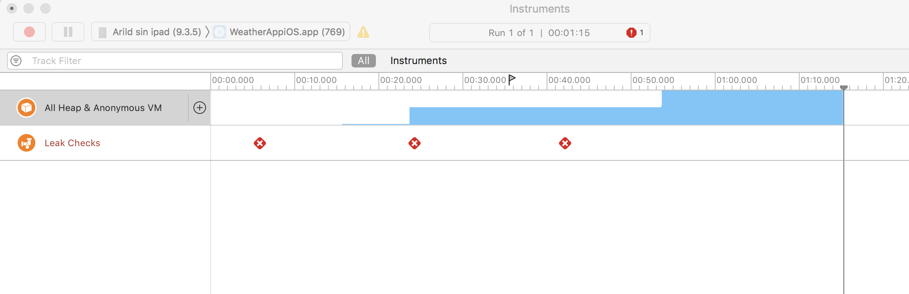

When you click on the top right button "history", the app is navigating to a Xamarin Forms Page. The issue is that the memory allocated is not released, and if you do this multiple times, the app will crash

# Microsoft Build 2017 - Weather Sample - Xamarin.Forms Embedding (PREVIEW)
